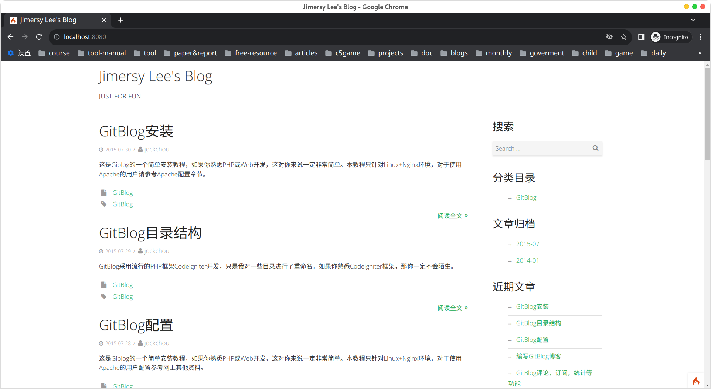

## 一. 简介 ##
GitBlog是一个简单易用的Markdown博客系统，它不需要数据库，没有管理后台功能，更新博客只需要添加你写好的Markdown文件即可。它摆脱了在线编辑器排版困难，无法实时预览的缺点，一切都交给Markdown来完成，一篇博客就是一个Markdown文件。同时也支持评论，代码高亮，数学公式，页面PV统计等常用功能。GitBlog提供了不同的主题样式，你可以根据自己的喜好配置，如果你想自己制作博客主题，也是非常容易的。GitBlog还支持整站静态导出，你完全可以导出整站静态网页部署到Github Pages。


此项目衍生自[codeigniter4-git-blog](https://github.com/screw-coding/codeigniter4-git-blog),主要是为了实验不同框架的快速实现一个基于markdown的博客系统.

预览



## 二. 功能特点 ##

1. 使用Markdown
2. 评论框,支持disqus
3. 代码高亮
4. PV统计
5. Latex数学公式
6. 自制主题
7. 响应式
8. 全站静态导出
9. 良好的SEO
10. 使用现代的composer管理包
11. 使用最新的ThinkPHP6框架

## 三. thinkphp-git-blog优势 ##

1. 无需数据库，系统更轻量，移植更方便
2. 使用Markdown编写，摆脱后台编辑排版困难，无法实时预览的缺点
3. 可全站静态导出
4. 配置灵活，可自由开关某些功能
5. 多主题支持，可自制主题
6. 博客，分类，标签，归档

## 四. 环境要求 ##

- PHP 7.2.5+ 建议php8.0以上,我目前使用的8.1.8的开发环境
- 安装composer包管理
- 需要扩展
  - ext-mbstring
  - ext-dom
  - ext-json
  - ext-intl
- php.ini开启short_open_tag = On,这个是默认开启的

## 五. 安装步骤 ##

1. 下载thinkphp-git-blog源代码
2. 解压上传到你的PHP网站根目录
3. 配置nginx或者apache
4. 打开浏览器，访问网站首页
5. 上传Markdown文件到`blog`文件夹

## 六. 详细说明 ##

- [1. 安装](blog/install.md)  
- [2. 目录结构](blog/struct.md)  
- [3. 配置说明](blog/config.md)
- [4. 编写博客](blog/edit.md)
- [5. 评论，订阅，统计等](blog/other-func.md)
- [6. 缓存机制](blog/cache.md)
- [7. 全站静态导出](blog/export.md)
- [8. 主题制作](blog/theme.md)
- [9. 在Nginx上运行GitBlog](blog/nginx.md)  
- [10. 在Apache上运行GitBlog](blog/apache.md)
- [11. 在SAE上运行GitBlog](blog/sae.md)
- [12. 使用GitBlog和Github Pages搭建博客](blog/github-pages.md)  
- [13. Gitblog升级](blog/update.md)
- [14. 从wordpress导入](blog/wordpress.md)

## 七. 问题及bug反馈 ##

issue提出

## 八. 使用者列表 ##


## 九. 感谢 ##

GitBlog的成长需要喜欢Markdown，喜欢写博客的各位亲们支持！感谢你们使用GitBlog，感激你们对Gitblog的良好建议和Bug反馈。

- [jockchou](https://github.com/jockchou)
- [Jetbrains PhpStorm](https://www.jetbrains.com/phpstorm/)
- [codeigniter4-git-blog](https://github.com/screw-coding/codeigniter4-git-blog)
## 十. 快速开始 ##

```shell
  git clone https://github.com/screw-coding/thinkphp-git-blog
  composer install
  cp .example.env .env
  php think run
```


## 十一.版权 ##

本项目使用[MIT](LICENSE)
